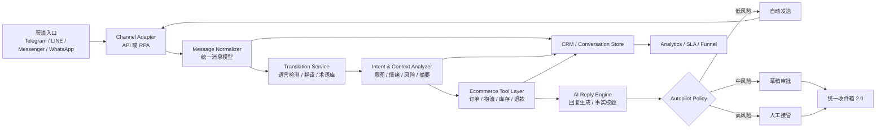

# AI 跨境电商客服平台：竞品调研与升级开发文档

更新日期：2026-05-31

## 1. 目标定位

本项目不再只定位为“聊天翻译器”或“多平台 RPA 机器人”，而应升级为：

**面向跨境电商团队的 AI 多平台客服作战台**。聚合 WhatsApp、LINE、Messenger、Telegram 等渠道，对每句客户消息进行自动翻译、意图识别、上下文分析、订单/物流/售后业务查询，并按风险等级自动回复、生成草稿或转人工。支持文本、图片、语音、工单、客户画像、团队协作和私有化部署。

一句话卖点：

> 不只是翻译消息，而是让一个客服用 AI 同时服务多个国家、多个平台、多个账号，并把聊天直接变成订单转化与售后闭环。

## 2. 调研范围与结论

本次调研覆盖：

- HelloWord 官网：`https://www.helloword.com.cn/` 及其动态路由 `/product/`、`/priceStand/`、`/downLoad/`。
- 国内跨境聊天翻译/SCRM：易翻译、HelloWorld/HelloWord、ChatKnow、ChatX-SCRM、OneChat、拓译 Tranlico、海象、FBsee、SendWS、NexScrm、ChatMain。
- 国际同类产品：respond.io、WATI、Trengo、SleekFlow、Zoko、Chatwoot、Whatomate。
- GitHub/开发者社区：Chatwoot、whatsapp-cloud-inbox、Evolution API、OpenWA、automagik-omni、ChatterMate、Herobot、Obsidian AI WhatsApp Channel、Whatomate、Owly 等。

公开资料的共同结论：

1. **“聚合聊天 + 自动翻译 + 应用多开 + 快捷回复 + 群发/计数”已经是基础功能**，不能作为长期壁垒。
2. **AI 自动回复正在成为新卖点**，但多数竞品仍停留在“生成建议/快捷话术”，缺少业务数据闭环。
3. **真正的市场缺口是：跨平台上下文统一、订单/物流/售后自动处理、人工接管安全、可私有化部署、账号健康与合规风控。**
4. 我们现有项目已经有 Telegram、LINE、Messenger、WhatsApp RPA、AI 回复、审批、TTS、知识库、联系人交接和后台，因此应走“AI 电商业务中台 + 多平台执行层”的路线，而不是重新做一个翻译壳。

## 3. HelloWord 功能拆解

### 3.1 官网公开功能

HelloWord 官网首页是 Nuxt 动态页面，普通抓取只显示 Loading；通过浏览器运行后可见以下页面内容。

`/product/` 显示：

- 聚合社交：WhatsApp、Facebook、Instagram、Line、Tinder 等主流社交软件。
- 全语种覆盖：多语言即时沟通。
- 多源翻译：整合国内外智能翻译资源。
- 特色功能：
  - 双向自动翻译
  - 应用无限多开
  - 企业账户管理
  - 高效获客
  - 好友统计
  - 自动回复
  - 客户档案

`/priceStand/` 显示：

- 新用户 10000 试用字符。
- 基础版：¥200，150 万字符，有道翻译、百度翻译、小牛翻译、独立应用版、手机版。
- 高级版：¥350，150 万字符，谷歌翻译、腾讯翻译，加基础版通道。
- 专业版：¥850，150 万字符，DeepL、亚马逊 AWS 翻译，加高级版通道。

`/downLoad/` 显示：

- Windows 10/11 64 位、Windows 10/11 32 位、Windows 7 64 位、Windows 7 32 位。
- Windows 精简版。
- Mac M 芯、Mac Intel 芯。
- Android 手机版：KakaoTalk、WhatsApp、Viber、Telegram、Snapchat。
- 独立应用版：Signal 翻译客户端、Telegram 翻译桌面版。

`/question/` 显示：

- 企业账户和子账户规则：购买两份字符以上升级企业账户，并可增加子账户权限；子账户由总账户划拨字符。

### 3.2 HelloWord 的产品本质

HelloWord 本质上不是单纯“Google 无头浏览器翻译器”，而是：

- 桌面客户端/移动端/独立应用组合。
- 多聊天应用聚合与多开。
- 多翻译引擎字符计费。
- 企业主账号、子账号、字符量分配。
- 基础 SCRM：好友统计、客户档案、自动回复、获客。

技术实现可能是混合式：

- 官方 API 能接的渠道走 API，例如 Telegram、部分 Facebook/WhatsApp Business。
- 个人号/普通社交 APP 场景走桌面 WebView、移动端多开、ADB/RPA 或客户端注入式自动化。
- 翻译通道走第三方翻译 API 或自研代理服务，不等于通过 Chrome 无头无痕浏览器调用网页翻译。

## 4. 竞品能力矩阵

| 产品 | 公开核心能力 | 可借鉴点 | 我们应超越的点 |
|---|---|---|---|
| HelloWord | 聚合社交、双向翻译、多开、企业子账户、字符套餐、客户端下载矩阵 | 字符包商业模式、客户端多形态、企业账户 | AI 业务闭环、订单/售后自动处理、风险审批、私有化 |
| 易翻译 | 账号管理、自动翻译、多翻译通道、应用集成、多开、客户资料库、群发 | 功能命名简单直接，适合非技术用户 | 不只翻译，要做意图分析和自动业务动作 |
| ChatKnow | 18+ 社交 APP、200+ 翻译线路、AI/Google/DeepL、代理 IP、工单、分流、标签、群发、图片/语音翻译 | 代理/IP、工单、分流、标签、图片语音翻译 | 深度电商数据联动和 AI 自动决策 |
| OneChat | 36+ 平台、本地数据、AI 翻译、AI 助手、人设、语音克隆、客户情报 | 本地数据主权、客户情报、语音克隆 | 合规可控的 AI 客服工作流 |
| 拓译 Tranlico | 200+ 语种、应用多开、聚合聊天、AI 回复、历史回答训练、工单、TTS、沙盒、安全监控 | 历史回答训练 AI、文本转语音、工单数据看板、沙盒 | 订单查询、物流查询、退款处理、SLA 和转化分析 |
| respond.io | 全渠道、自动化、AI Agent、AI Assist、CRM 集成、生命周期管理、SLA | 自动化工作流、生命周期和转化分析 | 更低成本私有化、更适合中文跨境团队和个人号场景 |
| Chatwoot | 开源、自托管、全渠道 inbox、AI Agent、帮助中心、标签、自动分配、快捷回复 | 开源架构、帮助中心、团队协作 | 社交个人号 RPA、多语言翻译、电商客服 SOP |
| Whatomate | 自托管 WhatsApp、通话/IVR、录音、模板、活动、统一 inbox、REST API | 语音通话、模板合规、REST-first、自托管 | 多平台、多语种、AI 意图与电商工具调用 |

## 5. GitHub 与开发者社区启发

### 5.1 可借鉴开源项目

- **Chatwoot**：开源客服台，支持 live chat、email、Facebook、Instagram、Twitter/X、WhatsApp、Telegram、LINE、SMS；有 AI Agent、帮助中心、标签、快捷回复、自动分配等。
- **whatsapp-cloud-inbox**：Next.js WhatsApp Cloud API inbox，支持模板、按钮、媒体、24 小时窗口限制、失败状态和 WhatsApp 风格 UI。
- **Evolution API**：WhatsApp 集成 API，支持 Baileys Web API 和 Meta Cloud API，并可集成 Typebot、Chatwoot、Dify、OpenAI、RabbitMQ、Kafka、S3/MinIO。
- **OpenWA**：开源 WhatsApp API Gateway，强调无厂商锁定、数据库/存储/缓存可插拔。
- **Whatomate**：Go + Vue 自托管 WhatsApp 平台，包含通话、IVR、录音、模板、活动、统一 inbox、REST API。
- **automagik-omni**：面向 AI Agent 的统一消息网关，把 WhatsApp、Discord、Slack 等抽象成统一 API。
- **Obsidian AI WhatsApp Channel**：通过 Baileys 侧车接 WhatsApp，QR 登录，进入 FastAPI Agent 流程，支持语音转写、长期记忆、人类介入。
- **ChatterMate/Herobot/Owly**：强调自托管 AI 客服、知识库、人工接管、CRM、自动化规则、Docker Compose 部署。

### 5.2 社区反馈中的真实痛点

开发者社区里反复出现的痛点不是“能不能接一个渠道”，而是：

- AI 不确定时如何升级人工。
- 知识库如何保持新鲜，避免过期答案。
- 多渠道进来后，客户历史如何统一。
- WhatsApp 24 小时窗口、模板消息和风控如何管理。
- 小团队不想被 SaaS 按坐席/按联系人/按消息长期收费，希望可私有化和可自托管。
- 客服效率不只看回复量，还要看转化、SLA、退款/售后处理时长。

## 6. 我们现有项目能力对标

当前项目已经具备这些基础资产：

- 多平台执行层：
  - Telegram MTProto：`src/client/telegram_client.py`
  - LINE RPA：`src/integrations/line_rpa/`
  - Messenger RPA：`src/integrations/messenger_rpa/`
  - WhatsApp RPA：`src/integrations/whatsapp_rpa/`
- Web 后台和统一收件箱：
  - `src/web/routes/unified_inbox_routes.py`
  - `src/web/templates/unified_inbox.html`
- AI 回复与策略：
  - `src/ai/ai_client.py`
  - `src/skills/skill_manager.py`
  - `config/reply_strategies.yaml`
- 知识库和域包：
  - `domains/ecommerce/`
  - `src/utils/kb_store.py`
  - `docs/KB_DIRECT_REPLY_SPEC.md`
- 语音能力：
  - `src/ai/tts_pipeline.py`
  - Messenger/WhatsApp voice sender/grabber。
- 审批和人工接管：
  - Messenger approvals。
  - LINE/WhatsApp pending 队列。
- 联系人与交接：
  - `src/contacts/`
  - `docs/CONTACTS_RPA_INTEGRATION.md`
- 可观测：
  - metrics、audit、logs、Grafana dashboard。

主要缺口：

1. 统一收件箱还是“待处理聚合”，不是完整客服工作台。
2. 没有独立的 Translation Service，翻译能力分散在各 Skill 或 Prompt 中。
3. 电商域还停留在基础话术，没有真实 Shopify/Shopee/Lazada/ERP/物流接口。
4. 没有标准化的 Message Normalizer：不同平台消息结构、媒体、语言、客户 ID 尚未统一。
5. 客户画像和跨平台身份已有雏形，但没有完整 CRM 页面和销售漏斗。
6. 缺少 WhatsApp 官方 API/模板/24 小时窗口的合规发送层。
7. 缺少商业化必需的多租户、套餐、子账号字符量、部署向导。

## 7. 市场突破口

### 7.1 不卷“翻译准确率”，卷“业务自动完成率”

竞品普遍宣传“200+ 语言、99% 准确率”，但买家真正关心的是：

- 客户问物流，能不能直接查到物流并回复？
- 客户要退货，能不能判断政策、生成退货指引并建工单？
- 客户砍价，能不能结合利润和库存给可接受优惠？
- 客户投诉，能不能及时升级人工并保留证据？

我们的突破口：**AI 工具调用 + 电商业务 API + 风险审批**。

### 7.2 做“跨境电商客服专用”，不要做泛社交万能工具

泛社交产品会被功能清单拖慢。我们优先服务跨境卖家：

- 独立站卖家：Shopify/WooCommerce。
- 东南亚/中东市场：WhatsApp、LINE、Messenger、Telegram。
- 多语言客服团队：中文客服服务海外客户。
- 小团队/中小卖家：希望低成本私有化，不想买高价 SaaS。

### 7.3 用私有化和数据主权打差异

OneChat、Whatomate、Chatwoot、OpenWA 都说明“自托管/数据自有”是市场卖点。我们可以强化：

- 本地/私有服务器部署。
- 聊天数据、客户数据、订单数据不出企业服务器。
- 支持自带 LLM、Ollama、OpenAI compatible、Gemini、DeepSeek 等。
- 支持仅把脱敏文本送外部模型。

### 7.4 用“个人号 RPA + 官方 API 双轨”覆盖灰色地带和合规地带

竞品常见问题是平台封号和稳定性。我们的方案：

- 官方 API：企业客户、合规消息、模板、Webhook、可审计。
- RPA/移动端：普通个人号、早期获客、客服人工辅助。
- 统一抽象成 Channel Adapter，前端看不到底层差异。
- 对每个账号做健康度、节奏、限流、风控和人工确认。

## 8. 产品方案：AI Global Commerce Desk

### 8.1 核心模块

1. **统一收件箱 2.0**
   - 全平台会话列表。
   - 完整聊天时间线。
   - 原文/译文并排。
   - AI 意图标签、情绪、风险等级。
   - AI 草稿、人工编辑、一键发送。
   - 客户资料、订单、物流、工单侧栏。

2. **Translation Service**
   - 自动语言检测。
   - 多引擎翻译：LLM、Google/DeepL/腾讯/百度等可插拔。
   - 翻译缓存和术语库。
   - 电商专有词汇：尺码、颜色、物流、退款、材质、保修。
   - 双向翻译：客户语言 -> 中文；中文客服回复 -> 客户语言。

3. **Intent & Context Analyzer**
   - 意图：商品咨询、价格优惠、库存、物流、退货退款、投诉、催单、复购、无效/骚扰、人工。
   - 上下文摘要：最近问题、未解决事项、客户偏好、订单号。
   - 情绪/紧急度：不满、急迫、犹豫、高意向。
   - 回复策略：自动回、草稿待审、人工介入、静默。

4. **Ecommerce Tool Layer**
   - Shopify/WooCommerce 第一优先级。
   - 订单查询、物流查询、库存查询、商品推荐、优惠券生成、退款政策判断。
   - 插件式扩展 Shopee/Lazada/TikTok Shop/Amazon/自有 ERP。
   - 所有工具调用保留审计日志。

5. **AI Reply Engine**
   - 根据意图、客户语言、订单数据、知识库生成回复。
   - 回复前进行事实校验：不能编造订单状态、价格、库存。
   - 支持多风格：专业、亲切、简短、销售型、安抚型。
   - 支持多候选回复和最佳回复评分。

6. **Risk-Based Autopilot**
   - L0：只翻译，不回复。
   - L1：生成草稿，人工确认。
   - L2：低风险自动回复，如欢迎语、物流已签收、常见 FAQ。
   - L3：中风险审批，如优惠、退款、投诉。
   - L4：高风险强制人工，如支付异常、威胁投诉、敏感信息、平台规则问题。

7. **Voice & Media**
   - 语音消息转写、翻译、总结。
   - 回复文本转语音，多语种音色。
   - 图片 OCR：订单截图、物流截图、产品图、地址截图。
   - 图片/语音类消息生成处理摘要。

8. **CRM & Funnel**
   - 客户标签、国家、语言、来源平台、最近意图、订单数、成交额。
   - 潜客阶段：新线索、询价、待付款、已购买、售后、沉默、复购。
   - 跟进提醒和自动唤醒。
   - 员工绩效：响应时间、解决率、转化率、客户满意度。

9. **Channel Gateway**
   - 官方 API Adapter：Telegram、WhatsApp Cloud API、LINE OA、Facebook/Instagram。
   - RPA Adapter：LINE App、Messenger App、WhatsApp App。
   - Web Adapter：后续可接网站客服窗。
   - 统一消息模型：Message、Conversation、Contact、Attachment、SendTask。

10. **Commercial Ops**
    - 主账号/子账号。
    - 字符量、AI token、语音分钟数、设备数、账号数。
    - 租户隔离、权限、审计。
    - 部署向导、设备绑定、健康检查。

## 9. 核心架构

## 10. 数据模型升级

建议新增或抽象以下核心表/模型：

- `channels`：平台、账号、接入方式、健康状态、租户、设备。
- `conversations`：平台会话、联系人、状态、负责人、最后消息、风险等级。
- `messages`：统一消息表，保存原文、译文、语言、方向、媒体、平台 message id。
- `message_analysis`：意图、情绪、关键词、订单号、摘要、置信度。
- `reply_drafts`：AI 草稿、译文、审批状态、发送结果、操作者。
- `contacts`：跨平台客户身份、标签、语言、国家、订单关联。
- `orders_cache`：外部电商订单只读缓存。
- `translation_memory`：原文 hash、译文、引擎、术语版本、命中次数。
- `automation_rules`：自动回复策略、风险规则、触发条件。
- `agent_actions`：AI 工具调用审计。

短期仍可用 SQLite；进入多租户和高并发后迁移 PostgreSQL + Redis。

## 11. 开发路线与周期

### Phase 0：产品基线与技术整理（1 周）

目标：把现有能力盘清，冻结第一版范围。

交付：

- 竞品功能矩阵和本开发文档。
- 统一消息模型草案。
- 翻译服务接口草案。
- 电商域意图字典 v1。
- 风险等级策略 v1。

验收：

- 能明确第一版只做 WhatsApp + Telegram + Messenger/LINE 中已稳定渠道。
- 统一收件箱 2.0 原型确认。

### Phase 1：统一收件箱 2.0 + 自动翻译（2-3 周）

目标：先把竞品基础能力做扎实。

开发：

- 改造 `unified_inbox_routes.py`：从 pending 聚合升级为 conversations/messages 聚合。
- 新增 `TranslationService`：语言检测、翻译缓存、术语库、双向翻译接口。
- Web UI 显示原文/中文译文/回复译文。
- 手动发送时自动翻译成客户语言。
- 会话侧栏展示客户语言、平台、标签、最近意图。

验收指标：

- 4 个平台至少 2 个可展示完整对话。
- 每条消息可看到原文和中文译文。
- 中文回复可自动转成客户语言发送。
- 翻译结果有缓存，重复句子不重复消耗字符。

### Phase 2：AI 意图分析 + 草稿审批（2-3 周）

目标：从翻译器升级成 AI 客服辅助。

开发：

- 新增 `IntentAnalysisService`：意图、情绪、紧急度、风险等级。
- 新增 `reply_drafts` 统一草稿层，整合 Messenger approvals、LINE/WA pending。
- UI 支持 AI 草稿、改写、翻译、批准、驳回、人工接管。
- 风险策略：低风险可自动，高风险强制人工。
- 针对电商意图增加 Prompt 和 KB：商品咨询、物流、退货、投诉、优惠。

验收指标：

- 意图识别准确率在样本集达到 85%+。
- 草稿审批流程跨至少 2 个平台可用。
- 高风险意图不会自动发送。
- 每条 AI 回复可追踪使用了哪些上下文和知识库。

### Phase 3：电商业务工具调用（3-4 周）

目标：形成市场突破点。

开发：

- Shopify/WooCommerce 连接器二选一优先。
- 订单查询工具：订单号、邮箱、手机号匹配。
- 物流查询工具：17Track/AfterShip/自定义物流 API 适配。
- 商品/库存查询工具：SKU、价格、库存、变体。
- 退款/售后 SOP：根据订单状态和政策生成处理建议。
- 回复事实校验：没有查到数据时不编造。

验收指标：

- 客户问订单/物流，AI 能调用工具并生成准确回复。
- 回复中订单状态、物流状态、库存来自真实数据。
- 人工可在 UI 看到 AI 调用结果和原始数据。
- 典型电商 FAQ 自动解决率达到 50%+。

### Phase 4：语音/图片/客户画像增强（2 周）

目标：超越普通文字翻译器。

开发：

- 语音消息自动转写、翻译、摘要。
- TTS 回复：按客户语言生成语音。
- 图片 OCR：地址、订单截图、商品图备注。
- 客户画像：语言、国家、购买阶段、意向评分、投诉风险。
- 跟进提醒：沉默客户、待付款客户、售后未解决客户。

验收指标：

- 语音消息能转成文本并进入同一分析流程。
- AI 可生成文本或语音回复。
- 客户画像随对话自动更新。

### Phase 5：商业化与私有化部署（3-4 周）

目标：让产品能卖、能试用、能部署。

开发：

- 多租户基础：租户、用户、角色、权限。
- 套餐计量：字符、AI token、语音分钟、账号数、设备数。
- 部署向导：配置 AI、翻译、渠道、设备、Webhook。
- 账号健康面板：设备在线、RPA 成功率、失败截图、风控提醒。
- Docker Compose 标准化部署。
- 数据备份、恢复、日志脱敏。

验收指标：

- 新客户可按向导完成基础配置。
- 单租户私有化部署可稳定运行 7 天。
- 关键错误有告警和恢复建议。

整体开发周期：

- 可演示 MVP：6-8 周。
- 可试点商用版：10-12 周。
- 可规模交付版：14-16 周。

## 12. 第一版 MVP 范围建议

为了尽快做出可销售样品，MVP 不建议追求 18+ 平台。第一版只做：

- 渠道：WhatsApp RPA、Telegram、Messenger RPA，LINE 作为可选。
- 功能：统一收件箱 2.0、自动翻译、AI 草稿、风险审批、TTS 预览。
- 电商：先接 Shopify 或模拟订单 API，再抽象通用 ERP connector。
- 管理：客户标签、会话状态、人工接管、响应时间统计。

MVP 不做：

- 大规模群发营销。
- 复杂多租户计费。
- 36+ 平台全覆盖。
- 完整 BI 报表。
- 所有电商平台一次性接完。

## 13. 技术实现原则

1. **不要把核心能力押在无头无痕浏览器上。**
   - Web 自动化可做补充，但账号稳定性和风控不可控。
   - 优先官方 API，其次移动端 RPA，最后才是 Web 自动化。

2. **所有渠道必须走统一消息模型。**
   - 避免每个平台单独写 AI 逻辑。
   - 后续新增渠道只实现 Adapter。

3. **AI 自动发送必须有风险分层。**
   - 退款、优惠、支付、投诉、敏感信息不能直接自动发。
   - 所有自动动作可追溯。

4. **翻译要产品化，不要藏在 Prompt 里。**
   - 有缓存、有术语库、有引擎、有成本统计。

5. **电商数据只能查，不可编。**
   - 订单、物流、库存、价格必须来自工具或明确标注未知。

6. **优先私有化部署能力。**
   - 跨境团队非常在意账号、客户、订单数据安全。

## 14. 竞标优势话术

对比传统聊天翻译器：

- 他们解决语言问题，我们解决订单转化和售后效率问题。
- 他们显示翻译，我们直接分析客户意图并生成可发送回复。
- 他们让客服复制粘贴，我们让 AI 调订单、查物流、建工单。
- 他们以字符包计费，我们可按账号/自动化/私有化交付。

对比国际 SaaS：

- 更适合中文跨境团队。
- 支持个人号/RPA 和官方 API 双轨。
- 可私有化部署，数据不被海外 SaaS 锁定。
- 可接本地 ERP、中文客服流程和小语种市场。

对比开源客服系统：

- Chatwoot 等强在客服台，但弱在社交 APP 多开、RPA、实时翻译和中文跨境场景。
- 我们可以借鉴它的 inbox/协作/帮助中心，但用 AI 和电商工具调用做垂直突破。

## 15. 参考资料

- HelloWord 官网：`https://www.helloword.com.cn/`
- HelloWorld 镜像站功能页：`https://helloword-cn.com/`
- 易翻译：`https://yifanyi.cc/`
- 易翻译-jvip：`https://yifanyi-jvip.com.cn/`
- ChatKnow 文档：`https://docs.chatknow.com/`
- ChatX-SCRM：`https://chatxscrm.com/`
- OneChat：`https://onechat.chat/`
- 拓译 Tranlico：`https://www.tranlico.com/`
- Chatwoot GitHub：`https://github.com/chatwoot/chatwoot`
- whatsapp-cloud-inbox：`https://github.com/gokapso/whatsapp-cloud-inbox`
- Evolution API：`https://github.com/evolution-foundation/evolution-api`
- OpenWA：`https://github.com/rmyndharis/OpenWA`
- Whatomate：`https://whatomate.io/`
- automagik-omni：`https://github.com/namastexlabs/automagik-omni`

