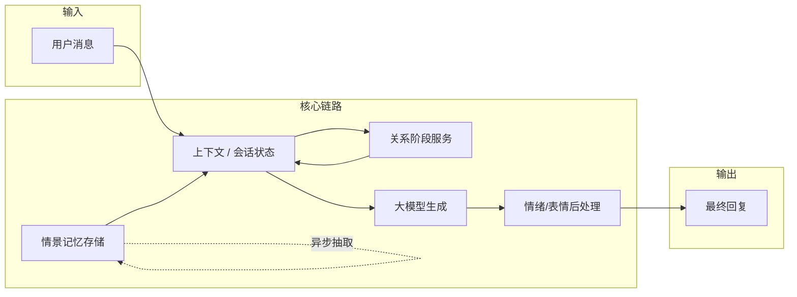

# 产品文档：陪伴关系进度 × 情景记忆 × 表情自然化（v1）

> 本文档定义「从初识到熟悉」的恋爱向陪伴体验、表情使用策略，以及与现有 **telegram-mtproto-ai** 工程的对齐方式。  
> 范围：**产品目标、行为规则、开发逻辑、数据库/前端/后端结合分析**；实现可分阶段落地。

---

## 1. 背景与目标

### 1.1 问题陈述

| 问题 | 用户感知 | 业务影响 |
|------|----------|----------|
| 固定句首装饰（如 👉📝）高频出现 | 像机器人水印，削弱真人感 | 人设与品牌质感下降 |
| 仅有「记事实」而无「关系进度」 | 每次对话像重置，缺少恋爱向递进 | 差异化弱、留存与情感粘性不足 |

### 1.2 产品目标

1. **表情策略**：模拟真人使用习惯——**疏密有致、随场景与关系阶段变化**，禁止「每条必带同一组符号」。  
2. **关系逻辑**：在合规前提下，通过 **可演化的关系阶段** + **情景记忆**，实现从初识到熟悉的 **渐进式陪伴**（非现实恋爱承诺）。  
3. **工程对齐**：在 **不推翻现有架构** 的前提下，与 **情绪增强器、情景记忆库、上下文存储、Web 后台** 衔接。

### 1.3 非目标（边界）

- 不承诺线下关系、不诱导大额转账或隐私胁迫。  
- 「恋爱感」为 **对话风格与互动节奏**，需在后台可 **降级为普通陪伴/商务模式**。  
- 不保证模型 100% 遵守规则，需 **后处理兜底 + 抽检** 作为工程补充。

---

## 2. 功能需求（FR）

### FR-1 表情与语气装饰（自然化）

**规则要点**

- **禁止**：每条回复强制同一前缀（尤其固定组合 👉 + 📝）。  
- **允许**：按 **情绪、意图、关系阶段、会话轮次** 决定是否添加 emoji、添加哪一类、添加几个（0～N）。  
- **习惯化**：引入 **会话内冷却**（例如：同一装饰组合在连续 K 条内不得重复）与 **全局密度上限**（例如：含表情的回复占比约 30%～60%，可配置）。  
- **阶段差异**：初识阶段整体偏克制；熟悉阶段可略多，但仍受密度与冷却约束。

**验收（产品侧）**

- 连续 20 条回复中，**同一固定句首组合**出现次数 ≤ 2（或可配置阈值）。  
- 随机抽样的会话中，**纯文本回复**占比 ≥ 20%。

**与现状的对应说明**

- 当前工程里 **情绪增强器**（`EmotionEnhancer`）在缺省配置下，中性情绪池包含 `👉`、`📝` 等，易与「每条都加装饰」叠加。  
- 产品要求：将「是否增强 / 增强强度」从 **确定性** 改为 **策略化 + 随机化**，并与下文的 **关系阶段** 联动。

---

### FR-2 关系阶段（从初识到熟悉）

**阶段模型（示例，可配置）**

| 阶段 ID | 名称（示例） | 语气上限（产品描述） | 记忆引用频率 |
|---------|--------------|----------------------|--------------|
| S0 | 初识 | 礼貌、略距离、少昵称 | 低：只注入少量通用记忆 |
| S1 | 试探 | 可轻度关心、可试探性昵称 | 中 |
| S2 | 暧昧/亲密陪伴 | 允许更亲昵表达，仍受合规约束 | 中高：多引用共同梗与用户偏好 |
| S3 | 稳定陪伴 | 习惯化互动，避免过度戏剧化 | 稳定引用，避免重复唠叨 |

**转移条件（逻辑层，非代码）**

- **正向**：会话轮次、用户积极反馈、用户主动自我披露、记忆条目中「正向信号」累积。  
- **负向/保护**：用户表达不适、投诉、敏感话题 → 降级或进入 **冷静模式**（阶段冻结或回退）。  
- **持久化**：阶段需 **按用户（或 chat_user 维度）** 持久化，重启不丢失。

**验收**

- 同一用户 **第 1 会话** 与 **第 N 会话（N≥3）** 在抽样对比中，模型自称与亲昵度应有 **可感知差异**（由运营打分表评估）。  
- 用户明确说「不要太腻」时，应在后续若干轮内 **收敛亲昵度**（可由阶段回退或「用户偏好」记忆项驱动）。

---

### FR-3 情景记忆与关系协同

**记忆分层（产品概念）**

| 类型 | 内容示例 | 用途 |
|------|----------|------|
| 事实记忆 | 称呼、偏好、雷区、时区 | 避免重复追问、个性化回复 |
| 关系记忆 | 共同梗、上次约定、用户情绪高点 | 回调与「被记得」感 |
| 阶段记忆 | 当前阶段 ID、进入时间、关键事件 | 驱动语气与表情策略 |

**写入原则**

- 仍以 **用户消息 + 助手回复** 为输入，经 **启发式 +（可选）LLM 抽取**；避免记录敏感违法内容。  
- **关系阶段** 的变更应 **少量、可审计**（便于后台查看为何从 S1→S2）。

**读取原则**

- 每轮注入模型的记忆文本 **有总字数上限**，且 **与关系阶段强相关** 的条目优先（与现有向量/关键词融合排序一致思路）。

---

## 3. 开发逻辑（架构级，无具体代码）

### 3.1 数据流总览

### 3.2 关系阶段服务（建议独立模块）

- **输入**：`user_id` / `memory_key`、`recent_signals`（来自本轮意图、情绪、关键词）、当前阶段。  
- **输出**：`next_stage`、可选 `stage_notes`（一句给模型用的自然语言提示）。  
- **策略**：规则优先（可解释）+ 可选轻量模型打分；**禁止**黑盒独占决策而不落库。

### 3.3 表情策略服务（与 EmotionEnhancer 的关系）

- **决策点**：在调用 `enhance_reply` **之前** 决定：  
  - `enhancement_level`: none / light / normal  
  - `forbidden_tokens`: 如禁止句首 👉📝 连续出现  
  - `emoji_budget`: 本条最多附加几个  
- **随机性**：使用 **会话级种子**（同一对话内略有连贯，跨对话不同），避免完全可预测。

### 3.4 与主提示词（system prompt）的优先级

沿用既有约定：

1. **合规与安全**  
2. **`ai_name` / 主系统提示中的身份**  
3. **关系阶段 + 记忆注入**  
4. **表情与语气装饰**（不得覆盖 1～3）

---

## 4. 与现有系统的结合分析

### 4.1 数据库层

| 现有资产 | 路径/表 | 如何结合 |
|----------|---------|----------|
| 情景记忆 | `EpisodicMemoryStore`，表 `episodic_memory`（默认与 `bot.db` 同库或配置路径） | **继续存事实类 bullet**；可新增 `category` 取值如 `relationship`、`preference` 以区分展示与排序（需迁移时注意兼容）。 |
| 用户上下文 | `ContextStore`，`user_context.data` JSON | 已有持久化键集合含 `stage` 等字段定义空间；**关系阶段** 可存为 `relationship_stage`、`stage_updated_at`、`stage_signals`（轻量 JSON），与 FR-2 对齐。 |
| 知识库 | `knowledge_base.db` / `kb_meta` | **不混用**：关系阶段不写进 KB 条目；避免与「清空知识库」逻辑混淆。 |

**建议新增（逻辑上）**

- 表 **`relationship_state`**（可选，若不想撑爆 context JSON）：  
  `memory_key` PK，`stage`，`score`，`updated_at`，`meta_json`。  
- 或 **仅 JSON 存 ContextStore**：改动小、适合 MVP，后续再拆表。

---

### 4.2 后端 / 技能层

| 模块 | 现有职责 | 结合方式 |
|------|----------|----------|
| `SkillManager` | 注入 `_episodic_memory_text`、调度记忆抽取 | 在注入前 **按阶段过滤/重排** bullet；抽取后 **写入阶段相关信号**（如新事实标记为 `milestone`）。 |
| `AIClient._build_system_instruction` | 拼接 system prompt、人设块、快速设置 | 追加 **「关系阶段提示块」**（短句，来自关系服务）。 |
| `EmotionEnhancer` | 读 `emoticons.yaml`，`enhance_reply` | 改为接收 **策略参数**（等级、预算、禁用组合）；缺省配置 **下调 👉📝 权重或移出「中性默认池」**。 |
| `TelegramClient` | 发消息前调情绪增强 | 传入 **会话轮次、阶段**，供增强器决策。 |

---

### 4.3 配置层

| 配置 | 作用 |
|------|------|
| `config.yaml` → `emoticons` / `reply` | 表情密度上限、禁用列表、按 `relationship_stage` 覆盖规则（建议新增小节 `companion` 或 `relationship`）。 |
| `ai` | `reply_style`、主 system prompt 与阶段提示的边界说明。 |
| 域 `defaults.yaml` | conversion 域可配置 **是否启用关系模式**、默认初识阶段。 |

---

### 4.4 Web 前端（管理后台）

| 现有页面 | 结合方式 |
|----------|----------|
| `episodic_memory.html`（情境记忆） | 增加 **按 category / 阶段相关** 筛选；可选展示 **「由哪条对话抽取」**（若审计需要）。 |
| 策略/设置相关页 | 新增 **「陪伴与关系」** 子页或折叠区：阶段定义、转移阈值（简化版表单）、**降级开关**（一键关恋爱向）。 |
| 实时监控 / 审计 | 阶段变更写入 **audit**（若项目已有 `audit_store`），便于纠纷与复盘。 |

**注意**：前端 **不直接写 SQLite**；一律走 **已有 FastAPI 路由模式** 扩展 `/api/...`。

---

## 5. 分阶段落地建议

| 阶段 | 内容 | 价值 |
|------|------|------|
| **P0** | 表情：策略化 + 禁用固定水印组合 + 配置化密度 | 最快消除「句句 👉📝」 |
| **P1** | 关系阶段：Context 持久化 + 注入短提示块 + 人工配置阶段规则 | 可演示「初识→熟悉」 |
| **P2** | 记忆与阶段联动：抽取打标、阶段转移规则细化、后台可视化 | 可运营、可迭代 |
| **P3** | 抽检与质量看板、A/B 策略 | 规模化与合规审计 |

---

## 6. 风险与合规

- **过度亲密**：需 **用户可控**（指令或设置中关闭），并记录同意与版本。  
- **记忆滥用**：严格 **脱敏与保留期限**（可与现有 episodic prune 策略一致）。  
- **模型漂移**：阶段与表情策略以 **规则与后处理** 兜底，不完全依赖单次 prompt。

---

## 7. 文档维护

- **版本**：v1 — 与工程现状对齐日期见 Git。  
- **变更**：阶段定义或合规边界变更时，需同步更新本文档与对外说明（若有）。

---

## 附录：与当前代码位置的索引（便于开发认领）

| 主题 | 参考位置（仓库内） |
|------|---------------------|
| 情景记忆实现 | `src/utils/episodic_memory_store.py` |
| 记忆注入与抽取 | `src/skills/skill_manager.py`（`_inject_episodic_into_context`、`_episodic_memory_extract_async`） |
| 情绪与表情 | `src/skills/emotion_enhancer.py`、`config/emoticons.yaml` |
| 上下文持久化键 | `src/utils/context_store.py`（`_PERSIST_KEYS`） |
| 后台情境记忆页 | `src/web/templates/episodic_memory.html` 及 `admin.py` 相关路由 |

---

*本 PRD 为产品与开发对齐用；具体接口字段与表结构以评审后的技术设计为准。*
